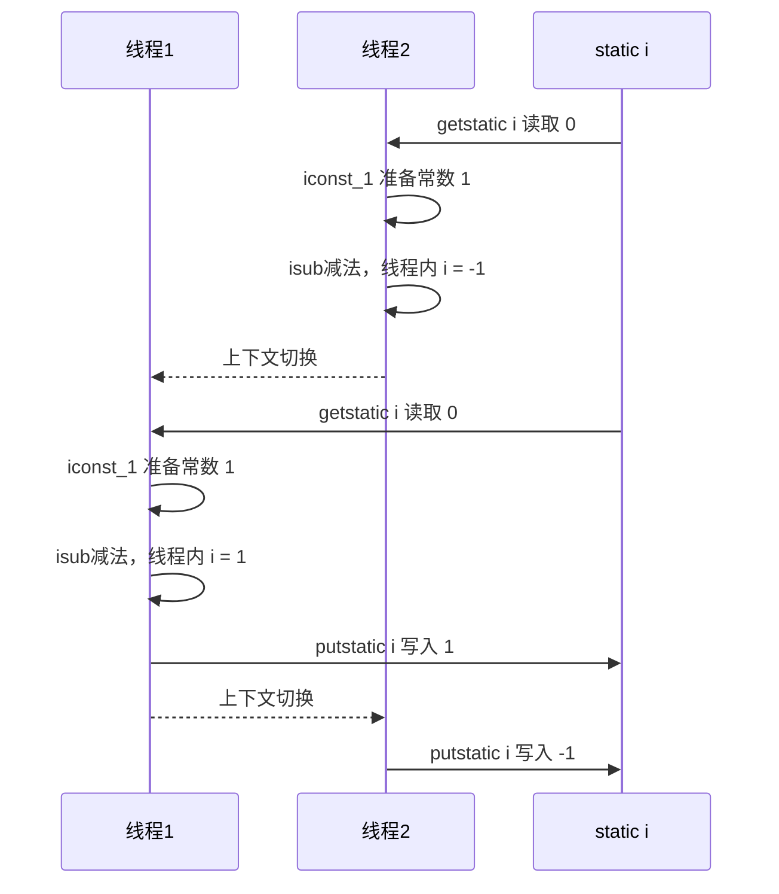
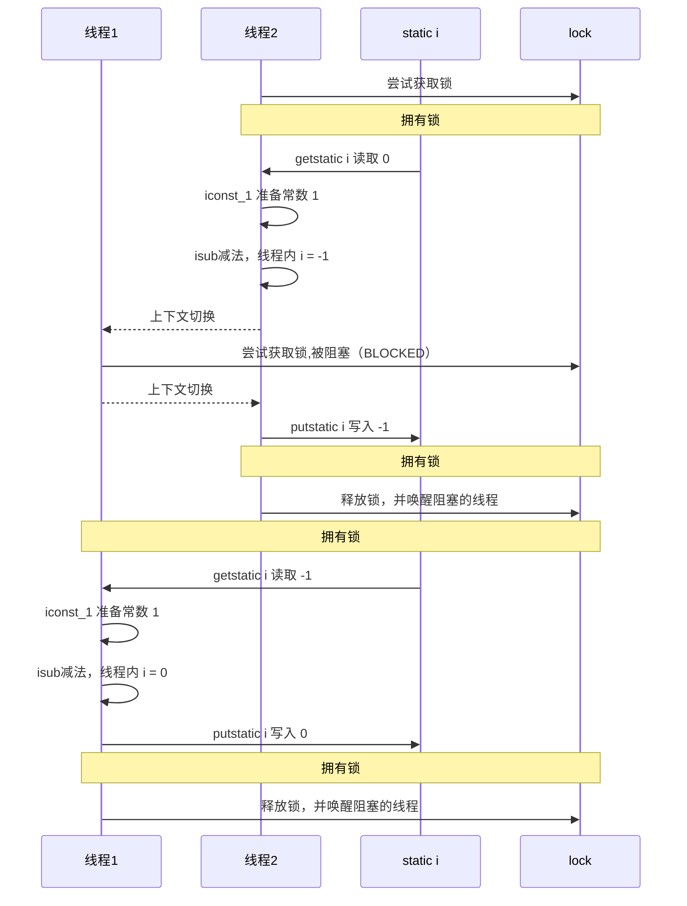
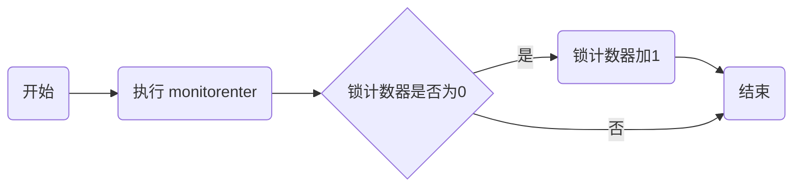
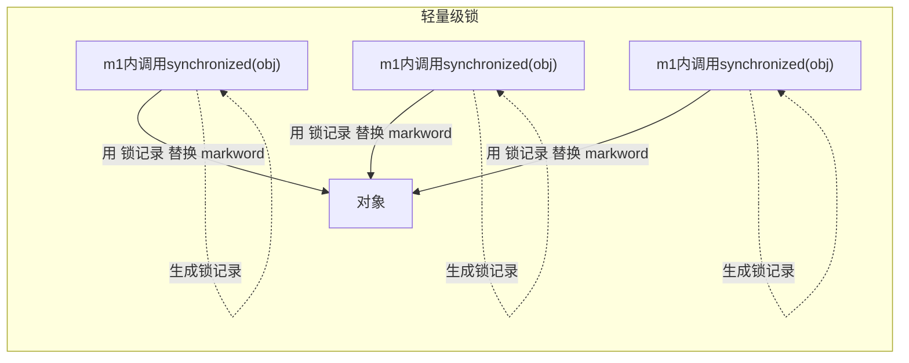
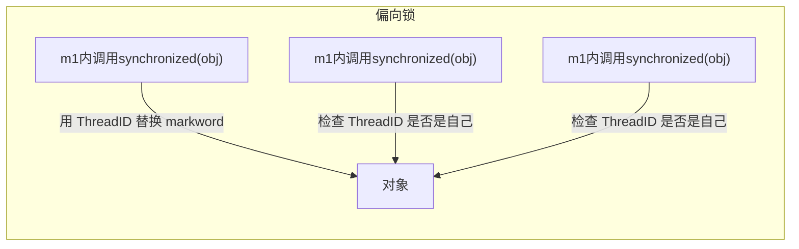

# 创建线程的几种方式

## 方式一：继承于Thread类  

```java
/**  
* 多线程的创建，
* 1.创建一个继承于Thread类的子类  
* 2.重写Thread类的run()  
* 3.创建Thread类的子类的对象  
* 4.通过此对象调用start()  
*  
*例子：遍历100以内的所有偶数  
*/  
  
//1.创建一个继承于Thread类的子类  
class MyThread extends Thread{

    @Override
    public void run() {
        for(int i = 0;i < 100;i++){
            if(i % 2 == 0){
                System.out.println(Thread.currentThread().getName() + ":" + i);
            }
        }
    }
}

public class ThreadTest {
    public static void main(String[] args) {
        MyThread t1 = new MyThread();
        MyThread t2 = new MyThread();

        t1.start();

        t2.start();

        for(int i = 0;i < 100;i++){
            if(i % 2 != 0){
                System.out.println(Thread.currentThread().getName() + ":" + i);
            }
        }
    }
}


```

## 方式二：实现Runnable接口

```java
/**
 * 创建多线程的方式二：实现Runnable接口
 * 1.创建一个实现了Runnable接口的类
 * 2.实现类去实现Runnable中的抽象方法：run()
 * 3.创建实现类的对象
 * 4.将此对象作为参数传递到Thread类的构造器中，创建Thread类的对象
 * 5.通过Thread类的对象调用start()
 *
 */
class MThread implements Runnable{

    public void run(){
        for (int i = 0; i < 100; i++) {
            if(i % 2 == 0){
                System.out.println(Thread.currentThread().getName() + ":" + i);
            }
        }
    }

}

public class ThreadTest1 {
    public static void main(String[] args) {
        MThread mThread = new MThread();
        Thread t1 = new Thread(mThread);
        t1.start();
        Thread t2 = new Thread(mThread);
        t2.start();
    }
}

```

# 常用的方法

``` java
/**
 * @author imagine
 * @date 2023/7/19/0019 - 17:56
 *
 * Thread.sleep 使当前执行的线程在指定的毫秒数内休眠(暂时停止执行)
 * thread.interrupt 打断调用该方法的线程对象,如果该线程是在sleep会抛出异常，
 *                  如果不是在睡眠，得调用Thread.currentThread().isInterrupted();获取打断标记
 * LockSupport.park();打断park线程,如果打断标记已经是 true, 则 park 会失效,可以使用 Thread.interrupted() 清除打断状态
 * Thread.yield 1.调用yield会让当前线程从Running进入Runnable就绪状态，然后调度执行其它线程
 *              2.具体地实现依赖于操作系统的任务调度器
 * thread.setPriority 设置优先级
 */
@Slf4j(topic = "c.CommonMethod")
public class CommonMethod {
    private static int count = 0;
    public static void main(String[] args) {
        Thread thread = new Thread(() -> {
            try {
                log.debug("start sleep......");
                count = 10;
                //sleep 使当前执行的线程在指定的毫秒数内休眠(暂时停止执行)
                Thread.sleep(1000);
                log.debug("end sleep!");
            } catch (InterruptedException e) {
                throw new RuntimeException(e);
            }
        });
        //启动线程
        thread.start();
        //等到thread这个线程对象的线程结束再执行使用了这个方法的那个线程

        try {
            thread.join();
        } catch (InterruptedException e) {
            throw new RuntimeException(e);
        }
        log.debug("count：{}",count);

        try {
            Thread.sleep(200);
        } catch (InterruptedException e) {
            throw new RuntimeException(e);
        }
        //获取线程状态
        log.debug("t1 state：{}",thread.getState());
        //打断调用该方法的线程
//        thread.interrupt();
    }
}

```

# 线程的状态

## 操作系统层面


- 【初始状态】仅是在语言层面创建了线程对象，还未与操作系统线程关联
- 【可运行状态】（就绪状态）指该线程已经被创建（与操作系统线程关联），可以由 CPU 调度执行
- 【运行状态】指获取了 CPU 时间片运行中的状态
	- 当 CPU 时间片用完，会从【运行状态】转换至【可运行状态】，会导致线程的上下文切换
- 【阻塞状态】
	- 如果调用了阻塞 API，如 BIO 读写文件，这时该线程实际不会用到 CPU，会导致线程上下文切换，进入【阻塞状态】
	- 等 BIO 操作完毕，会由操作系统唤醒阻塞的线程，转换至【可运行状态】
	- 与【可运行状态】的区别是，对【阻塞状态】的线程来说只要它们一直不唤醒，调度器就一直不会考虑调度它们
- 【终止状态】表示线程已经执行完毕，生命周期已经结束，不会再转换为其它状态

## JavaAPI层面


- NEW 线程刚被创建，但是还没有调用 start() 方法
- RUNNABLE 当调用了 start() 方法之后，注意，Java API 层面的 RUNNABLE 状态涵盖了 操作系统 层面的【可运行状态】、【运行状态】和【阻塞状态】（由于 BIO 导致的线程阻塞，在 Java 里无法区分，仍然认为是可运行）
- BLOCKED ， WAITING ， TIMED_WAITING 都是 Java API 层面对【阻塞状态】的细分，后面会在状态转换一节详述
- TERMINATED 当线程代码运行结束

```java
public enum State {
        NEW,
        RUNNABLE,
        BLOCKED,
        WAITING,
        TIMED_WAITING,
        TERMINATED;
}
```

```java
@Slf4j(topic = "c.TestState")
public class TestState {
    public static void main(String[] args) {
        //new
        Thread t1 = new Thread("t1") {
            @Override
            public void run() {
                log.debug("running");
            }
        };
        //runnable
        Thread t2 = new Thread("t2") {
            @Override
            public void run() {
                while (true){

                }
            }
        };
        t2.start();
        //terminated
        Thread t3 = new Thread("t3") {
            @Override
            public void run() {
                log.debug("running");
            }
        };
        t3.start();

        //获取锁成功 进入sleep->time-waiting
        Thread t4 = new Thread("t4") {
            @Override
            public void run() {
                synchronized (TestState.class){
                    try {
                        Thread.sleep(10000000);
                    } catch (InterruptedException e) {
                        throw new RuntimeException(e);
                    }
                }
            }
        };

        t4.start();

        //等待t2执行完,waiting
        Thread t5 = new Thread("t5") {
            @Override
            public void run() {
                try {
                    t2.join();
                } catch (InterruptedException e) {
                    throw new RuntimeException(e);
                }
            }
        };

        t5.start();

        //获取锁失败,blocked
        Thread t6 = new Thread("t6") {
            @Override
            public void run() {
                synchronized (TestState.class){
                    try {
                        Thread.sleep(10000000);
                    } catch (InterruptedException e) {
                        throw new RuntimeException(e);
                    }
                }
            }
        };

        t6.start();

        try {
            Thread.sleep(500);
        } catch (InterruptedException e) {
            throw new RuntimeException(e);
        }

        log.debug("t1 state {}",t1.getState());
        log.debug("t2 state {}",t2.getState());
        log.debug("t3 state {}",t3.getState());
        log.debug("t4 state {}",t4.getState());
        log.debug("t5 state {}",t5.getState());
        log.debug("t6 state {}",t6.getState());

    }
}

```

> 14:47:10.682 c.TestState [t3] - running
> 14:47:11.192 c.TestState [main] - t1 state NEW
> 14:47:11.193 c.TestState [main] - t2 state RUNNABLE
> 14:47:11.193 c.TestState [main] - t3 state TERMINATED
> 14:47:11.193 c.TestState [main] - t4 state TIMED_WAITING
> 14:47:11.193 c.TestState [main] - t5 state WAITING
> 14:47:11.193 c.TestState [main] - t6 state BLOCKED

# 共享带来的问题

## Java 的体现

```java
@Slf4j(topic = "c.Share")
public class Share {
    static int counter = 0;
    public static void main(String[] args) throws InterruptedException {
        Thread t1 = new Thread(() -> {
            for (int i = 0; i < 5000; i++) {
                counter++;
            }
        }, "t1");
        Thread t2 = new Thread(() -> {
            for (int i = 0; i < 5000; i++) {
                counter--;
            }
        }, "t2");
        t1.start();
        t2.start();
        t1.join();
        t2.join();
        log.debug("{}",counter);
    }
}
```

## 问题分析

以上的结果可能是正数、负数、零。为什么呢？因为 Java 中对静态变量的自增，自减并不是原子操作，要彻底理解，必须从字节码来进行分析
例如对于 i++ 而言（i 为静态变量），实际会产生如下的 JVM 字节码指令：

```java
getstatic i // 获取静态变量i的值
iconst_1 // 准备常量1
iadd // 自增
putstatic i // 将修改后的值存入静态变量i
```

而对应 i-- 也是类似：

```java
getstatic i // 获取静态变量i的值
iconst_1 // 准备常量1
isub // 自减
putstatic i // 将修改后的值存入静态变量i
```

而 Java 的内存模型如下，完成静态变量的自增，自减需要在主存和工作内存中进行数据交换：



- 一个程序运行多个线程本身是没有问题的
- 问题出在多个线程访问共享资源
  - 多个线程读共享资源其实也没有问题
  - 在多个线程对共享资源读写操作时发生指令交错，就会出现问题
- 一段代码块内如果存在对共享资源的多线程读写操作，称这段代码块为临界区

- 多个线程在临界区内执行，由于代码的执行序列不同而导致结果无法预测，称之为发生了竞态条件

## synchronized 解决方案

为了避免临界区的竞态条件发生，有多种手段可以达到目的。

- 阻塞式的解决方案：synchronized，Lock
- 非阻塞式的解决方案：原子变量

使用阻塞式的解决方案：synchronized，来解决上述问题，即俗称的【对象锁】，它采用互斥的方式让同一
时刻至多只有一个线程能持有【对象锁】，其它线程再想获取这个【对象锁】时就会阻塞住。这样就能保证拥有锁
的线程可以安全的执行临界区内的代码，不用担心线程上下文切换

```java
@Slf4j(topic = "c.SynchronizedTest")
public class SynchronizedTest {
    static int counter = 0;
    static final Object room = new Object();
    public static void main(String[] args) throws InterruptedException {
        Thread t1 = new Thread(() -> {
            for (int i = 0; i < 5000; i++) {
                synchronized (room) {
                    counter++;
                }
            }
        }, "t1");
        Thread t2 = new Thread(() -> {
            for (int i = 0; i < 5000; i++) {
                synchronized (room) {
                    counter--;
                }
            }
        }, "t2");
        t1.start();
        t2.start();
        t1.join();
        t2.join();
        log.debug("{}",counter);
    }
}
```



## 方法上的 synchronized

```java
class Test{
	public synchronized void test() {
        
	}
}
//等价于
class Test{
	public void test() {
		synchronized(this) {
            
		}
	}
}
```

```java
class Test{
	public synchronized static void test() {
        
	}
}
//等价于
class Test{
	public static void test() {
		synchronized(Test.class) {
            
		}
	}
}
```

## 变量的线程安全分析

### 成员变量和静态变量是否线程安全？

- 如果它们没有共享，则线程安全
- 如果它们被共享了，根据它们的状态是否能够改变，又分两种情况
  - 如果只有读操作，则线程安全
  - 如果有读写操作，则这段代码是临界区，需要考虑线程安全

### 局部变量是否线程安全？

- 局部变量是线程安全的
- 但局部变量引用的对象则未必
  - 如果该对象没有逃离方法的作用访问，它是线程安全的
  - 如果该对象逃离方法的作用范围，需要考虑线程安全

#### 局部变量线程安全分析

```java
public static void test1() {
	int i = 10;
	i++;
}
```

每个线程调用 test1() 方法时局部变量 i，会在每个线程的栈帧内存中被创建多份，因此不存在共享

局部变量的引用稍有不同
先看一个成员变量的例子

```java
public class TestThreadUnsafe {
    static final int THREAD_NUMBER = 2;
    static final int LOOP_NUMBER = 200;
    public static void main(String[] args) {
        ThreadUnsafe test = new ThreadUnsafe();
        for (int i = 0; i < THREAD_NUMBER; i++) {
            new Thread(() -> {
                test.method1(LOOP_NUMBER);
            }, "Thread" + i).start();
        }
    }
}
class ThreadUnsafe {
    ArrayList<String> list = new ArrayList<>();
    public void method1(int loopNumber) {
        for (int i = 0; i < loopNumber; i++) {
// { 临界区, 会产生竞态条件
            method2();
            method3();
            // } 临界区
        }
    }
    private void method2() {
        list.add("1");
    }
    private void method3() {
        list.remove(0);
    }
}
```
```java
new Thread(() -> {
    list.add("1");        // 时间1. 会让内部 size ++
    list.remove(0); // 时间3. 再次 remove size-- 出现角标越界
}, "t1").start();

new Thread(() -> {
    list.add("2");        // 时间1（并发发生）. 会让内部 size ++，但由于size的操作非原子性,  size 本该是2，但结果可能出现1
    list.remove(0); // 时间2. 第一次 remove 能成功, 这时 size 已经是0
}, "t2").start();
```

分析：

- 无论哪个线程中的 method2 引用的都是同一个对象中的 list 成员变量
- method3 与 method2 分析相同

将 list 修改为局部变量

```java
class ThreadSafe {
    public final void method1(int loopNumber) {
        ArrayList<String> list = new ArrayList<>();
        for (int i = 0; i < loopNumber; i++) {
            method2(list);
            method3(list);
        }
    }
    private void method2(ArrayList<String> list) {
        list.add("1");
    }
    private void method3(ArrayList<String> list) {
        list.remove(0);
    }
}
```

分析：

- list 是局部变量，每个线程调用时会创建其不同实例，没有共享
- 而 method2 的参数是从 method1 中传递过来的，与 method1 中引用同一个对象
- method3 的参数分析与 method2 相同

## Monitor 概念

### Java 对象头

以 32 位虚拟机为例

普通对象
```ruby
|--------------------------------------------------------------|
|                      Object Header (64 bits)                 |
|------------------------------------|-------------------------|
|                Mark Word (32 bits) |  Klass Word (32 bits)   |
|------------------------------------|-------------------------|
```

数组对象
```ruby
|---------------------------------------------------------------------------------|
|                          Object Header (96 bits)                                |
|--------------------------------|-----------------------|------------------------|
|        Mark Word(32bits)       |    Klass Word(32bits) |   array length(32bits) |
|--------------------------------|-----------------------|------------------------|
```

其中 Mark Word 结构为
```ruby
|-------------------------------------------------------|--------------------|
|                     Mark Word (32 bits)               |        State       |
|-------------------------------------------------------|--------------------|
|      hashcode:25 | age:4 | biased_lock:0         | 01 |        Normal      |
|-------------------------------------------------------|--------------------|
|      thread:23 | epoch:2 | age:4 | biased_lock:1 | 01 |        Biased      |
|-------------------------------------------------------|--------------------|
|                ptr_to_lock_record:30             | 00 | Lightweight Locked |
|-------------------------------------------------------|--------------------|
|            ptr_to_heavyweight_monitor:30         | 10 | Heavyweight Locked |
|-------------------------------------------------------|--------------------|
|                                                  | 11 |    Marked for GC   |
|-------------------------------------------------------|--------------------|
```

64 位虚拟机 Mark Word
```ruby
|--------------------------------------------------------------------|--------------------|
|                        Mark Word (64 bits)                         |        State       |
|--------------------------------------------------------------------|--------------------|
|   unused:25 | hashcode:31 | unused:1 | age:4 | biased_lock:0 | 01  |        Normal      |
|--------------------------------------------------------------------|--------------------|
|       thread:54 | epoch:2 | unused:1 | age:4 | biased_lock:1 | 01  |        Biased      |
|--------------------------------------------------------------------|--------------------|
|                   ptr_to_lock_record:62                      | 00  | Lightweight Locked |
|--------------------------------------------------------------------|--------------------|
|                   ptr_to_heavyweight_monitor:62              | 10  | Heavyweight Locked |
|--------------------------------------------------------------------|--------------------|
|                                                              |11   |     Marked for GC  |
|--------------------------------------------------------------------|--------------------|
```

## Monitor 原理

Monitor 被翻译为**监视器**或**管程**
每个 Java 对象都可以关联一个 Monitor 对象，如果使用 synchronized 给对象上锁（重量级）之后，该对象头的
Mark Word 中就被设置指向 Monitor 对象的指针

Monitor 结构如下


- 刚开始 Monitor 中 Owner 为 null
- 当 Thread-2 执行 synchronized(obj) 就会将 Monitor 的所有者 Owner 置为 Thread-2，Monitor中只能有一个 Owner
- 在 Thread-2 上锁的过程中，如果 Thread-3，Thread-4，Thread-5 也来执行 synchronized(obj)，就会进入EntryList BLOCKED
- Thread-2 执行完同步代码块的内容，然后唤醒 EntryList 中等待的线程来竞争锁，竞争的时是非公平的
- 图中 WaitSet 中的 Thread-0，Thread-1 是之前获得过锁，但条件不满足进入 WAITING 状态的线程，后面讲wait-notify 时会分析

> 注意：
>
> - synchronized 必须是进入同一个对象的 monitor 才有上述的效果
> - 不加 synchronized 的对象不会关联监视器，不遵从以上规则




## synchronized优化

### 轻量级锁

轻量级锁的使用场景：如果一个对象虽然有多线程要加锁，但加锁的时间是错开的（也就是没有竞争），那么可以使用轻量级锁来优化。
轻量级锁对使用者是透明的，即语法仍然是 synchronized
假设有两个方法同步块，利用同一个对象加锁

```java
static final Object obj = new Object();
public static void method1() {
	synchronized( obj ) {
		// 同步块 A
		method2();
	}
}
public static void method2() {
	synchronized( obj ) {
		// 同步块 B
	}
}
```

- 创建锁记录（Lock Record）对象，每个线程都的栈帧都会包含一个锁记录的结构，内部可以存储锁定对象的Mark Word
  
  
  
- 让锁记录中 Object reference 指向锁对象，并尝试用 cas 替换 Object 的 Mark Word，将 Mark Word 的值存入锁记录

  

- 如果 cas 替换成功，对象头中存储了 锁记录地址和状态 00 ，表示由该线程给对象加锁，这时图示如下

  

- 如果 cas 失败，有两种情况
	- 如果是其它线程已经持有了该 Object 的轻量级锁，这时表明有竞争，进入锁膨胀过程
	- 如果是自己执行了 synchronized 锁重入，那么再添加一条 Lock Record 作为重入的计数
	

- 当退出 synchronized 代码块（解锁时）如果有取值为 null 的锁记录，表示有重入，这时重置锁记录，表示重入计数减一


- 当退出 synchronized 代码块（解锁时）锁记录的值不为 null，这时使用 cas 将 Mark Word 的值恢复给对象头
  - 成功，则解锁成功
  - 失败，说明轻量级锁进行了锁膨胀或已经升级为重量级锁，进入重量级锁解锁流程

### 锁膨胀

如果在尝试加轻量级锁的过程中，CAS 操作无法成功，这时一种情况就是有其它线程为此对象加上了轻量级锁（有竞争），这时需要进行锁膨胀，将轻量级锁变为重量级锁。

```java
static Object obj = new Object();
public static void method1() {
	synchronized( obj ) {
	// 同步块
	}
}
```

- 当 Thread-1 进行轻量级加锁时，Thread-0 已经对该对象加了轻量级锁


- 这时 Thread-1 加轻量级锁失败，进入锁膨胀流程
	- 即为 Object 对象申请 Monitor 锁，让 Object 指向重量级锁地址
	- 然后自己进入 Monitor 的 EntryList BLOCKED
	


### 自旋

重量级锁竞争的时候，还可以使用自旋来进行优化，如果当前线程自旋成功（即这时候持锁线程已经退出了同步
块，释放了锁），这时当前线程就可以避免阻塞。

- 自旋会占用 CPU 时间，单核 CPU 自旋就是浪费，多核 CPU 自旋才能发挥优势。
- 在 Java 6 之后自旋锁是自适应的，比如对象刚刚的一次自旋操作成功过，那么认为这次自旋成功的可能性会高，就多自旋几次；反之，就少自旋甚至不自旋，总之，比较智能。
- Java 7 之后不能控制是否开启自旋功能

### 偏向锁

轻量级锁在没有竞争时（就自己这个线程），每次重入仍然需要执行 CAS 操作。
Java 6 中引入了偏向锁来做进一步优化：只有第一次使用 CAS 将线程 ID 设置到对象的 Mark Word 头，之后发现这个线程 ID 是自己的就表示没有竞争，不用重新 CAS。以后只要不发生竞争，这个对象就归该线程所有

```java
static final Object obj = new Object();
public static void m1() {
	synchronized( obj ) {
		// 同步块 A
		m2();
	}
}
public static void m2() {
	synchronized( obj ) {
		// 同步块 B
		m3();
	}
}
public static void m3() {
	synchronized( obj ) {
        // 同步块 C
	}
}
```





一个对象创建时：

- 如果开启了偏向锁（默认开启），那么对象创建后，markword 值为 0x05 即最后 3 位为 101，这时它的thread、epoch、age 都为 0
- 偏向锁是默认是延迟的，不会在程序启动时立即生效，如果想避免延迟，可以加 VM 参数 -XX:BiasedLockingStartupDelay=0 来禁用延迟
- 如果没有开启偏向锁，那么对象创建后，markword 值为 0x01 即最后 3 位为 001，这时它的 hashcode、age 都为 0，第一次用到 hashcode 时才会赋值

#### 撤销 - 调用对象 hashCode

调用了对象的 hashCode，但偏向锁的对象 MarkWord 中存储的是线程 id，如果调用 hashCode 会导致偏向锁被撤销变为正常对象
- 轻量级锁会在锁记录中记录 hashCode
- 重量级锁会在 Monitor 中记录 hashCode

#### 撤销 - 其它线程使用对象

当有其它线程使用偏向锁对象时，会将偏向锁升级为轻量级锁

#### 撤销 - 调用 wait/notify
#### 批量重偏向
如果对象虽然被多个线程访问，但没有竞争，这时偏向了线程 T1 的对象仍有机会重新偏向 T2，重偏向会重置对象的 Thread ID
当撤销偏向锁阈值超过 20 次后，jvm 会这样觉得，我是不是偏向错了呢，于是会在给这些对象加锁时重新偏向至加锁线程
#### 批量撤销
当撤销偏向锁阈值超过 40 次后，jvm 会这样觉得，自己确实偏向错了，根本就不该偏向。于是整个类的所有对象都会变为不可偏向的，新建的对象也是不可偏向的
### wait notify
